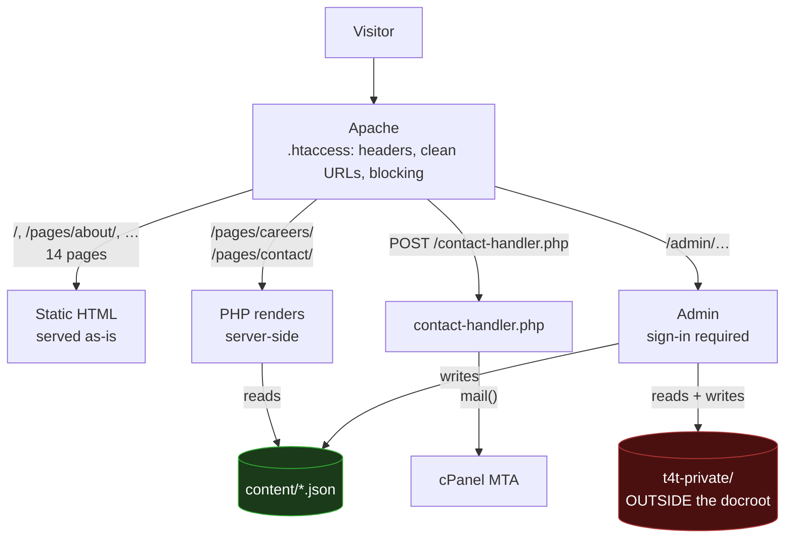
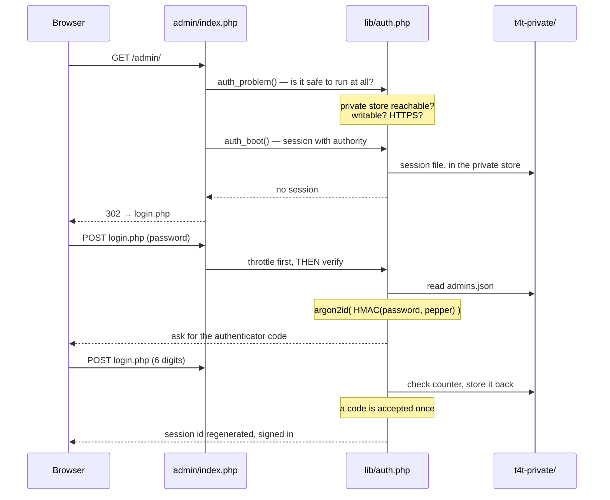
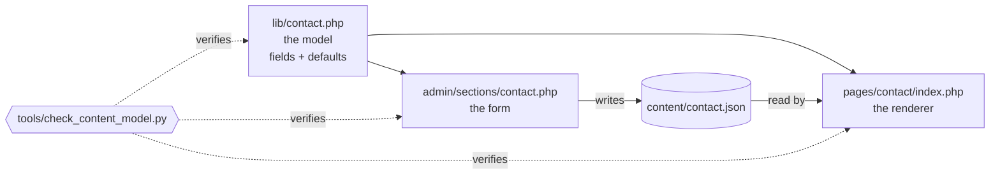
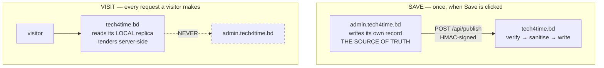

# Architecture

**Applies to:** both

How a request is served, where the data lives, and what talks to what. If you read one page before
touching the code, read this one.

---

## The whole picture



Two things carry the design.

**The green box is the content.** Two JSON files. The public pages read them; the admin writes them.
That is the entire content pipeline — no database, no cache layer, no API call in the request path.

**The red box is the secrets, and it is not inside the website.** It sits beside the document root
where no URL maps to it. Everything about the sign-in depends on that placement.

---

## Serving a page

### A static page — fourteen of the sixteen

```
GET /pages/about/
  → .htaccess adds security headers, resolves the extensionless URL
  → pages/about/index.html is returned
```

No PHP runs. The page contains its own inlined icon symbols, links the CSS it needs, and defers all
its JavaScript to the end of `<body>`. Nothing is fetched from another origin.

### A dynamic page — careers and contact

```
GET /pages/careers/
  → pages/careers/index.php
      require lib/careers.php    the shape of the data, and its defaults
      require lib/store.php      read content/careers.json from disk
      require lib/html.php       escape everything on the way out
  → HTML, fully rendered, in one request
```

Still one filesystem read and one page of output. The only difference from a static page is that
the words came out of a JSON file instead of being typed into the HTML.

**Why server-side and not `fetch()`:** a contact page whose addresses arrive by JavaScript is
indexed unreliably, and it is the page most often searched for by name. See
[0003-server-rendered-content.md](../90-decisions/0003-server-rendered-content.md).

### The admin



The order in that diagram is load-bearing in two places:

- **`auth_problem()` runs before anything else.** If the private store is missing or unwritable, the
  admin refuses to load rather than proceeding. An editor that quietly works without a password is
  worse than one that visibly does not work at all.
- **The lockout is checked *before* the password is verified.** Otherwise "you are locked out" and
  "that password was wrong" take different amounts of time, and the difference tells an attacker
  which guesses were close.

---

## Where the data lives

```
/home/USER/                            cPanel account home — not served
├── public_html/                       ← DOCUMENT_ROOT
│   ├── index.html  pages/  assets/
│   ├── lib/                           blocked by .htaccess
│   ├── content/                       blocked by .htaccess
│   │   ├── careers.json               job posts        ← the host's copy is the real one
│   │   └── contact.json               offices, numbers ← the host's copy is the real one
│   └── admin/
└── t4t-private/            0700       ← no URL maps here at all
    ├── secret.key          0600       32 bytes; every other key derives from it
    ├── admins.json         0600       hashes, authenticator secrets, recovery codes
    ├── sessions/                      session.save_path
    ├── throttle.json                  failed-attempt counters
    ├── resets.json                    pending reset codes, hashed
    └── audit.log                      one JSON line per sign-in event
```

Two different protections, for two different classes of data, and the difference is the point:

| | Protected by | If that fails |
|---|---|---|
| `content/` | an `.htaccess` rule | a stranger reads the office addresses the contact page already shows them |
| `t4t-private/` | **not being inside the website** | — there is no request that reaches it |

An `.htaccess` rule is a policy the server chooses to apply. It is exactly right for site copy and
not good enough for a value that mints valid two-factor codes. See
[0008-private-store-outside-docroot.md](../90-decisions/0008-private-store-outside-docroot.md).

---

## The content contract

The one invariant that keeps the editor and the page from drifting apart:



**The page renders straight from the JSON**, so there is no second copy of the structure to keep in
step. Add a field and three files must move together: the model, the form and the renderer.
`check_content_model.py` fails the build if one of the three is left behind — in either direction,
so a field removed from the page but left in the form is caught too.

The careers page has the same three layers and is proved differently, because both of its sides
consume their fields in a loop and a regex over the source reads the loop variable rather than the
fields. `test_careers_admin.py` posts a marker through every field the model declares and requires
it back off the public page.

Full walkthrough, including which page gets which check and why:
[content-model.md](../10-development/backend/content-model.md).

---

## What runs in the browser

Nothing is required. Everything degrades.

```
theme-init.js   ← the ONLY synchronous script, in <head>
                  two decisions that must happen before the first frame:
                  which theme to paint, and whether the scroll reveal is armed

… page renders …

nav.js  animations.js  forms.js  slider.js  terminal.js  tech-sphere.js
theme-toggle.js                          ← all deferred, at the end of <body>
main.js                                  ← runs last, calls each init()
                                           in a try/catch, so one broken
                                           feature cannot take the page down
```

Each module registers itself on `window.Tech4Time`. If `animations.js` never arrives, a watchdog
registered in `theme-init.js` lifts the hidden state at the load event — the reveal is decoration,
and decoration is not allowed to be the reason something cannot be read.

Detail: [javascript.md](../10-development/frontend/javascript.md) and
[motion.md](../10-development/frontend/motion.md).

---

## What is planned but not built

The repository is to be split in two, communicating over a signed API:



**The backend owns the content; the frontend holds a replica.** The direction of that arrow is the
whole design: a live API call per page view would make the admin panel a hard dependency of every
visitor request, costing indexability, availability, and 50–300 ms on what is currently a
filesystem read.

Not built yet. See [0010-backend-pushes-content.md](../90-decisions/0010-backend-pushes-content.md)
and [0011-two-repositories.md](../90-decisions/0011-two-repositories.md).
