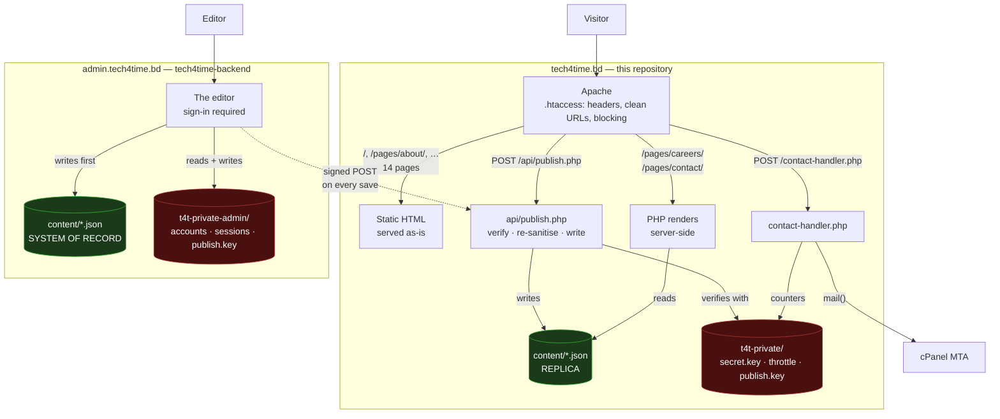
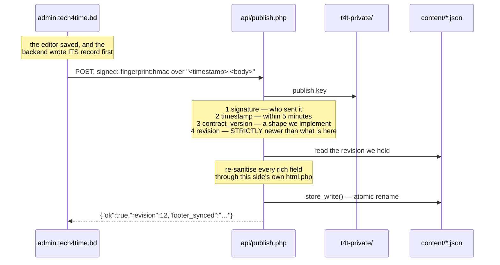
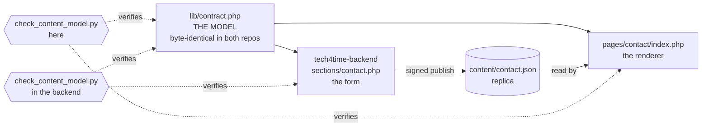

# Architecture

**Applies to:** both

How a request is served, where the data lives, and what talks to what. If you read one page before
touching the code, read this one.

---

## The whole picture



Three things carry the design.

**The green boxes are the content, and one of them is in charge.** The backend's copy is the system
of record and is written first; this site's is a replica it is *sent*. Editing the replica by hand
does not survive the next save in the admin.

**The dotted arrow goes one way, and only on a save.** The public site never calls the backend
during a request — not for content, not for the header, not for anything. That is
[0003](../90-decisions/0003-server-rendered-content.md) and
[0010](../90-decisions/0010-backend-pushes-content.md): a per-view API call would put indexability,
availability and 50–300 ms back into every page load.

**The red boxes are the secrets, and there are two of them.** Neither host can read the other's. The
public site holds no password hash and no name for a file that could contain one; the one value both
stores share is `publish.key`, which is what the dotted arrow is signed with.
[0017](../90-decisions/0017-two-private-stores.md)

---

## Serving a page

### A static page — fourteen of the sixteen

```
GET /pages/about/
  → .htaccess adds security headers, resolves the extensionless URL
  → pages/about/index.html is returned
```

No PHP runs. The page contains its own inlined icon symbols, links the CSS it needs, and defers all
its JavaScript to the end of `<body>`. Nothing is fetched from another origin.

### A dynamic page — careers and contact

```
GET /pages/careers/
  → pages/careers/index.php
      require lib/careers.php    the shape of the data, and its defaults
      require lib/store.php      read content/careers.json from disk
      require lib/html.php       escape everything on the way out
  → HTML, fully rendered, in one request
```

Still one filesystem read and one page of output. The only difference from a static page is that
the words came out of a JSON file instead of being typed into the HTML.

**Why server-side and not `fetch()`:** a contact page whose addresses arrive by JavaScript is
indexed unreliably, and it is the page most often searched for by name. See
[0003-server-rendered-content.md](../90-decisions/0003-server-rendered-content.md).

### Content arriving — `POST /api/publish.php`

The only request to this site that writes anything.



Each check answers something the others do not, and the fourth is the one that is easy to
under-rate:

- **The signature** proves the payload came from something holding the key. It proves nothing about
  whether the payload is *safe* — which is why every rich field goes back through this side's own
  `lib/html.php` afterwards. If the admin host were ever compromised, the public site should still
  not render script.
- **The timestamp** bounds how long a captured request stays useful. Five minutes either way,
  because the two clocks are different machines.
- **`contract_version`** refuses a document written in a shape this side does not implement, rather
  than writing one it would then mis-render.
- **The revision** is what actually stops a replay. Inside the five-minute window a captured request
  is signed perfectly well; it carries a revision this side already holds, and a document must be
  **strictly newer** to be written. So the replay is a no-op instead of a rollback of the live site
  to whatever it said five minutes ago.

If any of them refuses, the editor says so in words and offers to send it again. Never a silent gap.
[publish-api.md](../10-development/server-side/publish-api.md)

---

## Where the data lives

```
/home/USER/                            cPanel account home — not served
├── public_html/                       ← DOCUMENT_ROOT   tech4time.bd
│   ├── index.html  pages/  assets/
│   ├── api/publish.php                the only thing here that writes
│   ├── lib/                           blocked by .htaccess
│   └── content/                       blocked by .htaccess
│       ├── careers.json               ← a REPLICA. api/publish.php writes it
│       └── contact.json               ← a REPLICA. api/publish.php writes it
├── backend/                           tech4time-backend — see that repository
│   └── public/                        ← DOCUMENT_ROOT   admin.tech4time.bd
├── t4t-private/            0700       ← no URL maps here at all
│   ├── secret.key          0600       32 bytes; the throttle's keys derive from it
│   ├── throttle.json                  contact-form attempt counters
│   └── publish.key         0600       the SAME bytes as the backend's copy
└── t4t-private-admin/      0700       the backend's. Accounts, sessions, audit log
```

**Three entries in this side's store, and that is the point.** There are no password hashes here,
and no *name* for a file that could hold one — `T4T_PRIVATE_FILES` lists three things and
`t4t_private_path()` throws on a name it does not know. `tools/check_secrets.py` asserts it on every
run. [0017](../90-decisions/0017-two-private-stores.md)

Two different protections, for two different classes of data, and the difference is the point:

| | Protected by | If that fails |
|---|---|---|
| `content/` | an `.htaccess` rule | a stranger reads the office addresses the contact page already shows them |
| `t4t-private/` | **not being inside the website** | — there is no request that reaches it |

An `.htaccess` rule is a policy the server chooses to apply. It is exactly right for site copy and
not good enough for a key that signs what the live site is allowed to publish. See
[0008-private-store-outside-docroot.md](../90-decisions/0008-private-store-outside-docroot.md).

The backend goes one step further and puts `lib/`, `sections/` and `content/` outside its document
root too, so none of them depends on a rule at all —
[0018](../90-decisions/0018-the-backend-serves-from-a-subdirectory.md).

---

## The content contract

The one invariant that keeps the editor and the page from drifting apart:



**The page renders straight from the JSON**, so there is no second copy of the structure to keep in
step. Add a field and three things must move together: the model, the form and the renderer.

**The model is the shared file**, and that is what makes the two halves add up. `lib/contract.php`
is byte-identical in both repositories, so neither can change the shape without the other; each then
checks its own side against it. `check_content_model.py` says which half it ran and names the
repository that does the other, rather than quietly checking less than it used to.

The careers page has the same three layers and is proved differently, because both of its sides
consume their fields in a loop and a regex over the source reads the loop variable rather than the
fields. Here, `test_publish.py` sends a marker through every field the model declares and requires
it back off the public page; the backend's `test_careers_admin.py` walks the editor half.

Full walkthrough, including which page gets which check and why:
[content-model.md](../10-development/server-side/content-model.md).

---

## What runs in the browser

Nothing is required. Everything degrades.

```
theme-init.js   ← the ONLY synchronous script, in <head>
                  two decisions that must happen before the first frame:
                  which theme to paint, and whether the scroll reveal is armed

… page renders …

nav.js  animations.js  forms.js  slider.js  terminal.js  tech-sphere.js
theme-toggle.js                          ← all deferred, at the end of <body>
main.js                                  ← runs last, calls each init()
                                           in a try/catch, so one broken
                                           feature cannot take the page down
```

Each module registers itself on `window.Tech4Time`. If `animations.js` never arrives, a watchdog
registered in `theme-init.js` lifts the hidden state at the load event — the reveal is decoration,
and decoration is not allowed to be the reason something cannot be read.

Detail: [javascript.md](../10-development/frontend/javascript.md) and
[motion.md](../10-development/frontend/motion.md).

---

## What is not built

**Field-measured LCP, CLS and INP against the live host.** Everything so far is measured on a
development machine or a CI runner, both of which software-rasterise in headless Firefox. Real
numbers need a real throttled load against `tech4time.bd`.

The split itself is done: [0010](../90-decisions/0010-backend-pushes-content.md),
[0011](../90-decisions/0011-two-repositories.md), [0017](../90-decisions/0017-two-private-stores.md)
and [0018](../90-decisions/0018-the-backend-serves-from-a-subdirectory.md) are all built, and the
sequence diagram above is the running code rather than a plan.
